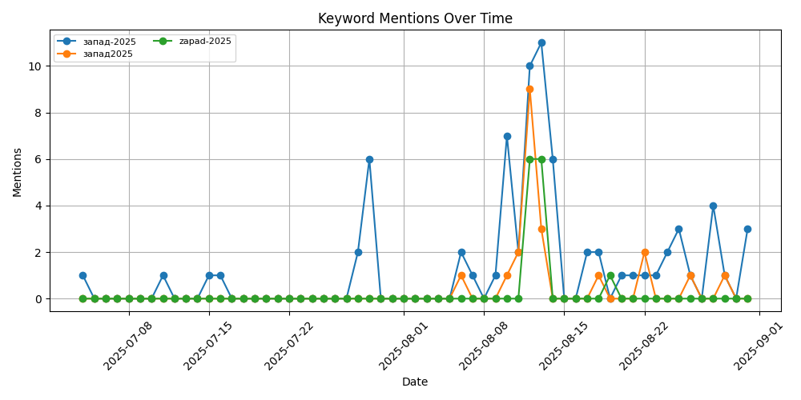

# CIA-Style Intelligence Report — 2025-09-01

**Source Dataset:** 59 Telegram messages

**Date Range:** July 04, 2025 — August 31, 2025

## 🧭 Executive Summary

Общая цель — проверка возможностей Республики Беларусь и Российской Федерации по обеспечению военной безопасности Союзного государства, готовности к отражению возможной агрессии».__ **Briefing by Chief of the International Military Cooperation Department, Assistant to the Defence Minister for Foreign Military Policy** **Major General Valery Revenko on the joint strategic exercise of the armed forces of the Republic of Belarus and the Russian Federation "Zapad-2025":** __🟢____"The joint strategic exercise of the armed forces of the Republic of Belarus and the Russian Federation "Zapad-2025" will take place from 12 to 16 September 2025. The overall objective is to test the capabilities of the Republic of Belarus and the Russian Federation to ensure the military security of the Union State and their readiness to repel possible aggression".__ Проголосовать за канал #Запад2025 Генерал-майор Валерий Ревенко о совместном стратегическом учении вооруженных сил Республики Беларусь и Российской Федерации «Запад-2025»: __🟢____«В ходе учения планируется отработка следующих вопросов: ____ ____отражение ударов средств воздушного нападения противника; ____ ____ведение оборонительного боя, разгром вклинившегося в оборону противника и создание условий для восстановления территориальной целостности государства; ____ ____ авиационная поддержка действий войск; ____ ____борьба с незаконными вооруженными формированиями и диверсионно-разведывательными группами противника. 31 июля мы передали расширенную информацию об учении и пригласили на наблюдение за ним представителей всех без исключения государств — участников Венского документа».__ **Briefing by Chief of the International Military Cooperation Department, Assistant to the Defence Minister for Foreign Military Policy** **Major General Valery Revenko on the joint strategic exercise of the armed forces of the Republic of Belarus and the Russian Federation "Zapad-2025":** __🟢____"In order to maintain regional security and restore trust and good-neighbourly relations in Europe, the Republic of Belarus intends to ensure maximum openness and transparency in its military activities. Его результатом, в свою очередь, является снижение стратегической стабильности в мире в целом».__ **Briefing by Chief of the International Military Cooperation Department, Assistant to the Defence Minister for Foreign Military Policy** **Major General Valery Revenko on the joint strategic exercise of the armed forces of the Republic of Belarus and the Russian Federation "Zapad-2025": ** __🟢____"Countries that send their observers will be able to see for themselves the openness and transparency of the drills. Одно из таких мероприятий – «Железный защитник»; 🟤продолжается публикация отдельными СМИ и интернет-ресурсами противоречивых, провокационных и не соответствующих действительности материалов о предстоящем учении; 🟤белорусско-российское совместное учение используется в качестве повода для непрекращающейся милитаризации и роста числа и масштабов мероприятий оперативной и боевой подготовки; 🟤приглашения для наблюдения за отдельными эпизодами учения также направлены в адрес других стран и международных организаций, в том числе ОДКБ, СНГ, ШОС. ️Тем не менее, как отметил на брифинге, посвященному учениям «Запад-2025», начальник Департамента международного военного сотрудничества Минобороны Беларуси генерал-майор Валерий Ревенко,__ «с приближением сроков проведения учения действия западных государств и, в первую очередь, сопредельных стран — членов НАТО, начали приобретать все более агрессивный характер».__ Несмотря на миролюбивую политику Минска и отсутствие учений «Запад» в 2023 и 2024 годах, Литва, Польша и Латвия разворачивают непропорциональные силы у белорусских границ. Сегодня это действительно необходимо: это вопросы, к примеру, ретрансляции радиосигнала с использованием беспилотных летательных аппаратов, где подвешивается соответствующий ретранслятор и в разы увеличивается дальность связи».__ **О взаимодействии войск связи с РЭБ в условиях реального подавления:** __ ____«Также в ходе данного учения мы работали во взаимодействии с нашими войсками РЭБ и радиоэлектронной разведкой в режиме реального подавления, воздействия на нашу систему связи. **Военный Осведомитель** **Заключительный этап подготовки перед «Запад-2025»** Главное из заявлений начальника связи ВС – начальника управления связи ГШ ВС генерал-майора Вадима Романива: 🟤в ходе учения успешно прошел апробацию программный продукт, который обеспечивает АСУ войсками, закончились государственные испытания, и сейчас мы полностью апробировали данный продукт в условиях и масштабах реального времени; 🟤одной из особенностей учения стало применение беспилотной авиации в интересах войск связи – это вопросы, к примеру, ретрансляции радиосигнала с использованием БЛА, где подвешивается соответствующий ретранслятор и в разы увеличивается дальность связи; 🟤в ходе данного учения мы работали во взаимодействии с нашими войсками РЭБ и РЭР в режиме реального подавления, воздействия на нашу систему связи; 🟤подводя предварительные итоги, я могу сделать вывод, что войска связи с поставленными задачами справятся точно и в срок; 🟤все вопросы организации взаимодействия управления мы уже отработали с нашими российскими коллегами.

_CPU TextRank summary_

## 🔹 Dominant Terms (TF-IDF)

| Term | Weight |
|---|---|
| связи | 2.5 |
| учения | 2.35 |
| беларусь | 2.21 |
| сил | 2.09 |
| беларуси | 1.94 |
| учений | 1.89 |
| вооруженных | 1.8 |
| вооруженных сил | 1.71 |
| запад-2025 | 1.66 |
| это | 1.59 |
| нато | 1.41 |
| обороны | 1.41 |
| республики | 1.27 |
| подготовки | 1.24 |

## 🔑 Tracked Keywords (User-Defined)

| Keyword | Mentions |
|---|---|
| запад 2025 | 95 |
| запад-2025 | 95 |
| запад2025 | 21 |
| zapad 2025 | 14 |
| zapad-2025 | 14 |
| zapad2025 | 0 |

## ♻️ Repetitive High-Signal Keywords (Auto)

| Keyword | Mentions |
|---|---|
| беларусь | 89 |
| учения | 82 |
| запад-2025 | 74 |
| сил | 65 |
| беларуси | 63 |
| это | 56 |
| учений | 54 |
| связи | 50 |
| вооруженных | 47 |
| нато | 44 |
| обороны | 39 |
| республики | 37 |
| подготовки | 33 |
| войск | 31 |
| ____ | 31 |
| 2025 | 28 |
| латвии | 27 |
| года | 27 |
| также | 26 |
| безопасности | 25 |
| учение | 25 |
| территории | 24 |
| которые | 24 |
| евро | 24 |
| страны | 23 |
| государства | 23 |
| стран | 23 |
| рамках | 22 |
| запад2025 | 21 |
| military | 21 |
| будут | 19 |
| европе | 18 |
| войны | 18 |
| военной | 18 |
| границ | 18 |

## 📊 Keyword Mention Trends

## 🧠 Information Warfare / Propaganda Indicators

Detected **46** messages containing propaganda cues.

> **Главное из новостей Европы и Ближнего Зарубежья за эту неделю** Галопом по Европе: Глава Госпогранкомитета Беларуси Константин Молостов рассказал о нюансах общения с западными странами. Живое общение и встречи по вопросам пограничного сотрудничества ушли в прошлое. Теперь взаимодействие сводится к ([source](https://t.me/alekseystefanov/12141))
> **Главное из новостей Европы и Ближнего Зарубежья за эту неделю** Галопом по Европе: Глава Госпогранкомитета Беларуси Константин Молостов рассказал о нюансах общения с западными странами. Живое общение и встречи по вопросам пограничного сотрудничества ушли в прошлое. Теперь взаимодействие сводится к ([source](https://t.me/milwarhummer/13312))
> 🟢Беларусь, под мудрым руководством Александра Лукашенко, уверенно укрепляет свою обороноспособность, опираясь на нерушимый союз с Россией. Повышение боевого потенциала Вооруженных Сил Республики Беларусь (ВС РБ) благодаря поставкам новых образцов вооружения, военной и специальной техники (ВВСТ), осо ([source](https://t.me/milwarhummer/13332))
> ️**Минск гасит искры – Запад раздувает пламя военной истерии** Совместные белорусско-российские учения «Запад-2025», изначально задумывавшиеся как крупнейшие за последнее время, будут проведены в сокращенном формате и вдали от границ, чтобы не обострять и без того накаленную обстановку в регионе. __ ([source](https://t.me/runeurope/18611))
> ️**Минск гасит искры – Запад раздувает пламя военной истерии** Совместные белорусско-российские учения «Запад-2025», изначально задумывавшиеся как крупнейшие за последнее время, будут проведены в сокращенном формате и вдали от границ, чтобы не обострять и без того накаленную обстановку в регионе. __ ([source](https://t.me/milwarhummer/13390))
> **Главное о новостях Европы и ближнего зарубежья:** Галопом по Европе: В Республику Беларусь прибыл первый эшелон с российскими военнослужащими и техникой для подготовки к совместным учениям «Запад-2025». Об этом сообщило Минобороны Беларуси. Точка разлома: 17-летний сын Рамзана Кадырова Адам продол ([source](https://t.me/tchk14/1188))
> **Главное о новостях Европы и ближнего зарубежья:** Галопом по Европе: В Республику Беларусь прибыл первый эшелон с российскими военнослужащими и техникой для подготовки к совместным учениям «Запад-2025». Об этом сообщило Минобороны Беларуси. Точка разлома: 17-летний сын Рамзана Кадырова Адам продол ([source](https://t.me/ZhivetZheBelarus/48199))
> **Политический символ или "пороховая бочка": зачем нужен Сувалкский коридор?** Генералы НАТО держат планы быстрого переброски десятков тысяч солдат в район Сувалкского коридора — всего 65 км между Беларусью и Калининградом. Тут возводят новые оборонительные сооружения, проводят учения. Всё ради возм ([source](https://t.me/ZhivetZheBelarus/48210))
> **Главное о новостях Европы и ближнего зарубежья:** Галопом по Европе: В Республику Беларусь прибыл первый эшелон с российскими военнослужащими и техникой для подготовки к совместным учениям «Запад-2025». Об этом сообщило Минобороны Беларуси. Точка разлома: 17-летний сын Рамзана Кадырова Адам продол ([source](https://t.me/tenipribaltiki/3340))
> **Главное о новостях Европы и ближнего зарубежья:** Галопом по Европе: В Республику Беларусь прибыл первый эшелон с российскими военнослужащими и техникой для подготовки к совместным учениям «Запад-2025». Об этом сообщило Минобороны Беларуси. Точка разлома: 17-летний сын Рамзана Кадырова Адам продол ([source](https://t.me/BalticBridge/5554))

## ⏱️ Time-Sensitive Observables

- **Troop movement** (`перемещ`) mentioned **1** times
- **Mobilization references** (`мобилизац`) mentioned **1** times
- **Grodno deployments** (`гродно`) mentioned **1** times
- **Suwalki corridor** (`сувалк`) mentioned **5** times
- **Military exercises** (`учени`) mentioned **217** times
- **Strike implication** (`удар`) mentioned **54** times
- **Nuclear context** (`ядер`) mentioned **13** times
- **Oreshnik system** (`орешник`) mentioned **18** times
- **Quadriga-2025 (NATO)** (`quadriga`) mentioned **2** times
- **Żelazny Obrońca (PL)** (`żelazny`) mentioned **1** times
- **Namejs-2025 (LV)** (`namejs`) mentioned **4** times
- **Iron Spear / Shield (LT)** (`iron`) mentioned **1** times

## 👤 Actor Mentions

| Actor | Mentions |
|---|---|
| нато | 44 |
| лукашенко | 16 |
| одкб | 14 |
| минобороны | 14 |
| хренин | 13 |
| ревенко | 12 |
| польша | 8 |
| сша | 8 |
| муравейко | 8 |
| латвия | 6 |
| кадыров | 6 |
| литва | 5 |
| минск | 5 |
| шос | 4 |
| ес | 4 |
| мид | 4 |
| эстония | 2 |
| сердюков | 2 |
| путин | 1 |
| европа | 1 |
| украина | 1 |
| калининград | 1 |
| гродно | 1 |
| зеленский | 0 |
| киев | 0 |
| москва | 0 |
| брест | 0 |

## 🔎 Source-Corroborated Items (Cross-posted / Duplicates)

- **Главное из новостей Европы и Ближнего Зарубежья за эту неделю** Галопом по Европе: Глава Госпогранкомитета Беларуси Константин Молостов рассказал о нюансах общения с западными странами. Живое общение и встречи по вопросам пограничного сотрудничества ушли в прошлое. Теперь взаим _(seen in: alekseystefanov [https://t.me/alekseystefanov/12141], milwarhummer [https://t.me/milwarhummer/13312])_
- 🟢Беларусь, под мудрым руководством Александра Лукашенко, уверенно укрепляет свою обороноспособность, опираясь на нерушимый союз с Россией. Повышение боевого потенциала Вооруженных Сил Республики Беларусь (ВС РБ) благодаря поставкам новых образцов вооружения, военной и специальной _(seen in: milwarhummer [https://t.me/milwarhummer/13332])_
- США поставят для Украины вооружения на 300 млн. долларов, но заплатит за него Евросоюз, для Путина Трамп установил 50-дневный таймер — за это время, так хочет президент Соединенных Штатов, должен разрешиться конфликт между Россией и Украиной. И, наверное, если бы наши люди не чит _(seen in: alekseystefanov [https://t.me/alekseystefanov/12196])_
- ️**Кто и как в мире спекулирует на теме белорусско-российских учений «Запад-2025»?** Как известно, в середине сентября запланированы совместные учения Беларуси и России «Запад-2025». И в этом для адекватных людей нет и не было никаких секретов и поводов для спекуляций – информаци _(seen in: runeurope [https://t.me/runeurope/18605])_
- ️**Минск гасит искры – Запад раздувает пламя военной истерии** Совместные белорусско-российские учения «Запад-2025», изначально задумывавшиеся как крупнейшие за последнее время, будут проведены в сокращенном формате и вдали от границ, чтобы не обострять и без того накаленную обст _(seen in: runeurope [https://t.me/runeurope/18611], milwarhummer [https://t.me/milwarhummer/13390])_
- **В Беларусь прибыл первый эшелон с военнослужащими РФ и техникой** для подготовки к совместным учениям «Запад-2025». Об этом сообщает Министерство обороны республики. _(seen in: milwarhummer [https://t.me/milwarhummer/13473])_
- ** ️ В Республику Беларусь прибыл первый эшелон с российскими военнослужащими и техникой для подготовки к совместным учениям «Запад-2025». Об этом сообщило Минобороны Беларуси.** #Беларусь #Россия #учения #Запад2025 #военное_сотрудничество #Минобороны #армия #подготовка #военная_ _(seen in: runeurope [https://t.me/runeurope/18688])_
- **Главное о новостях Европы и ближнего зарубежья:** Галопом по Европе: В Республику Беларусь прибыл первый эшелон с российскими военнослужащими и техникой для подготовки к совместным учениям «Запад-2025». Об этом сообщило Минобороны Беларуси. Точка разлома: 17-летний сын Рамзана _(seen in: tchk14 [https://t.me/tchk14/1188], ZhivetZheBelarus [https://t.me/ZhivetZheBelarus/48199], tenipribaltiki [https://t.me/tenipribaltiki/3340], BalticBridge [https://t.me/BalticBridge/5554], alekseystefanov [https://t.me/alekseystefanov/12282], runeurope [https://t.me/runeurope/18730])_
- **Политический символ или "пороховая бочка": зачем нужен Сувалкский коридор?** Генералы НАТО держат планы быстрого переброски десятков тысяч солдат в район Сувалкского коридора — всего 65 км между Беларусью и Калининградом. Тут возводят новые оборонительные сооружения, проводят у _(seen in: ZhivetZheBelarus [https://t.me/ZhivetZheBelarus/48210])_
- #фотофакт участники совместного стратегического учения вооруженных сил Беларуси и России «Запад-2025» посетили мемориальный комплекс «Хатынь». Военнослужащим рассказали о трагических страницах истории Беларуси времен Великой Отечественной войны. Военнослужащие почтили память жерт _(seen in: modmilby [https://t.me/modmilby/49467])_
- ️ **#ГЛАВНОЕ_за_неделю** ** **Президент Беларуси Александр Лукашенко в интервью зарубежному изданию рассказал о белорусско-российских отношениях и обеспечении безопасности Союзного государства. ** **Законопроект «Об изменении законов по вопросам обеспечения военной безопасности и _(seen in: modmilby [https://t.me/modmilby/49471])_
- **В Варшаве белорусская оппозиция планирует создать новое "боевое крыло" ** Представители украинских и польских спецслужб собираются 9-10 августа на антибелорусских акциях. В МИД Беларуси вызван польский поверенный, ему вручена нота. Ранее существующее формирование будет распущен _(seen in: ZhivetZheBelarus [https://t.me/ZhivetZheBelarus/48231], tchk14 [https://t.me/tchk14/1219])_
- #Запад2025 ️Брифинг начальника Департамента международного военного сотрудничества — помощника Министра обороны по вопросам международного военного сотрудничества **генерал-майора Валерия Ревенко** о совместном стратегическом учении вооруженных сил Беларуси и России «Запад-2025» _(seen in: modmilby [https://t.me/modmilby/49502])_
- #Запад2025 Генерал-майор Валерий Ревенко: __🟢____«Совместное стратегическое учение вооруженных сил Республики Беларусь и Российской Федерации «Запад-2025» пройдет в период с 12 по 16 сентября 2025 года». Тема учения: «Применение группировок войск (сил) в интересах обеспечения вое _(seen in: modmilby [https://t.me/modmilby/49504])_
- #Запад2025 Генерал-майор Валерий Ревенко о совместном стратегическом учении вооруженных сил Республики Беларусь и Российской Федерации «Запад-2025»: __🟢____«В ходе учения планируется отработка следующих вопросов: ____ ____отражение ударов средств воздушного нападения противника; _(seen in: modmilby [https://t.me/modmilby/49505])_
- #Запад2025 Генерал-майор Валерий Ревенко: __🟢____«Учение «Запад» — это плановый элемент совместной подготовки сил и средств региональной группировки войск (сил). Ему предшествовал комплекс мероприятий, которые проводились как на территории Республики Беларусь, так и Российской Фе _(seen in: modmilby [https://t.me/modmilby/49506])_
- #Запад2025 Генерал-майор Валерий Ревенко: __🟢____«Для поддержания региональной безопасности и восстановления доверия и добрососедских отношений в Европе Республика Беларусь предусматривает обеспечение максимальной открытости и транспарентности проводимой военной деятельности. В э _(seen in: modmilby [https://t.me/modmilby/49507])_
- #Запад2025 Генерал-майор Валерий Ревенко: __ ____🟢____«Страны, которые направят своих наблюдателей, смогут убедиться в открытости и прозрачности маневров. Кроме того, возможность наблюдать за учением будут иметь все аккредитованные при Министерстве обороны Республики Беларусь ино _(seen in: modmilby [https://t.me/modmilby/49508])_
- ** ****ЧАСТЬ 1: Политика доброй воли или приглашение к провокации?** Беларусь и Россия предпринимают шаг за шагом всё, что возможно в рамках реальной деэскалации — ограничивают масштаб совместных учений, отводят их подальше от государственных границ, приглашают международных набл _(seen in: ZhivetZheBelarus [https://t.me/ZhivetZheBelarus/48251])_
- ** ****ЧАСТЬ 2: Политика доброй воли или приглашение к провокации?** Нельзя забывать и о невоенных методах воздействия. Беларусь и Россия всё чаще становятся мишенями для кибератак и психологических информационных кампаний, направленных как на подрыв внутренней стабильности, так _(seen in: ZhivetZheBelarus [https://t.me/ZhivetZheBelarus/48252])_
- ** ️**** Республика Беларусь и Российская Федерация готовятся к учениям «Запад-2025» с акцентом на прозрачность** ⏺Генерал-майор Валерий Ревенко заявил: «Для поддержания региональной безопасности и восстановления доверия и добрососедских отношений в Европе Республика Беларусь пре _(seen in: runeurope [https://t.me/runeurope/18747])_
- ⭐️**«Запад-2025» – плановый элемент совместной подготовки** ** **По мере приближения сроков проведения совсместных стратегических учений России и Беларуси действия западных государств, особенно сопредельных стран – членов НАТО, приобретают все более агрессивный характер. Так, нач _(seen in: ZhivetZheBelarus [https://t.me/ZhivetZheBelarus/48265])_
- ️ ️ ️**Первый сегодня заслушал закрытый доклад министра обороны, генерала Виктора Хренина. ** Основные его темы: подготовка к учениям Запад-2025 оперативная обстановка у границ Республики Беларуси готовность к реагированию на возникающие угрозы Скоро будут подробности! _(seen in: modmilby [https://t.me/modmilby/49545])_
- ** ****Белорусские и российские военные проведут совместное стратегическое учение "Запад-2025" с 12 по 16 сентября** В рамках подготовки запланировано отработать сценарии применения ядерного оружия и комплекса "Орешник". Об этом сообщил министр обороны Беларуси Виктор Хренин посл _(seen in: ZhivetZheBelarus [https://t.me/ZhivetZheBelarus/48271], tenipribaltiki [https://t.me/tenipribaltiki/3401])_
- **__«Мы демонстрируем свою открытость, миролюбие, но порох всегда надо держать сухим»__, — генерал-лейтенант Виктор Хренин.** ⭐️ Министр обороны Беларуси генерал-лейтенант Виктор Хренин после доклада Главе государства пообщался с журналистами: __🟢____«Сегодня у нас состоялся закр _(seen in: modmilby [https://t.me/modmilby/49546])_

---
_Generated by Hybrid pipeline (LLM + TextRank/TF-IDF)_.
